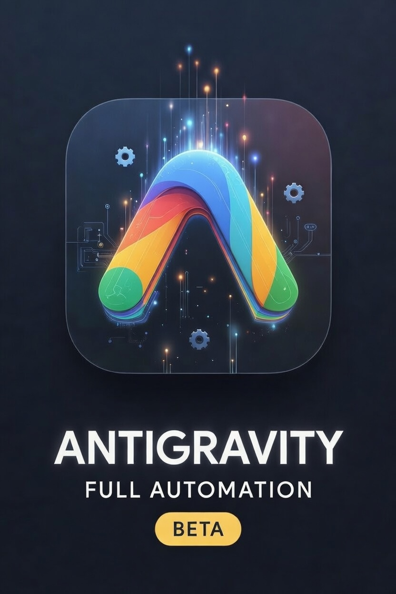

# Antigravity Automation

<p align="center">
  
</p>

<p align="center">
  <a href="https://antigravityautomation.com"></a>
  &nbsp;
  <a href="https://antigravityautomation.com/api/"></a>
</p>

<p align="center">
  <a href="https://www.npmjs.com/package/antigravity-automation"></a>
  &nbsp;
  <a href="https://pypi.org/project/antigravity-automation/"></a>
  &nbsp;
  <a href="https://antigravityautomation.com/#/sdks"></a>
</p>

---

The **Antigravity Automation** is an extension for automating and remotely controlling the Antigravity IDE. 

***Eliminate*** those pesky manual clicks but more than that, ***be able to interact with the chats from anywhere outside the ide to allow complete and full control.***


Recursive planning, execution and continuation using orchestrated workflows to leverage Antigravity as a piece of your larger workflows.

This extension injects a secure, lightweight communication bridge directly into your active VSCode Workbench, allowing you to orchestrate the AI using external scripts, automate repetitive conversational clicks, and export scraped content natively to your local filesystem.

## Features

- **100% Safe**: Locally ran, no data leaves your machine.
- **Auto-Run Automation**: Automatically detects and clicks the "Run" buttons inside the Antigravity chat, saving you from constant clicking during complex tasks.
- **Auto-Allow Execution**: Bypasses the "Allow this Conversation" prompts seamlessly.
- **Ability to Orchestrate Chats with AI**: Extension spins up a local server that you can send requests to in order to start new chats, send new messages, get data from the chats.
- **Bridge Control Dashboard**: An interactive Webview UI for toggling automation states and tracking real-time websocket activity.
- **One Click Button**: One Click button to easily enable or disable auto click

## Code Samples

Ready-to-run examples for interacting with every API endpoint in **8 languages**:

| Language | File |
|----------|------|
| 🐍 Python | [`code_samples/python/antigravity_api.py`](code_samples/python/antigravity_api.py) |
| 🟨 JavaScript | [`code_samples/javascript/antigravity_automation_api_examples.js`](code_samples/javascript/antigravity_automation_api_examples.js) |
| 🦀 Rust | [`code_samples/rust/src/antigravity_automation_api_examples.rs`](code_samples/rust/src/antigravity_automation_api_examples.rs) |
| 🐹 Go | [`code_samples/go/antigravity_automation_api_examples.go`](code_samples/go/antigravity_automation_api_examples.go) |
| 💎 Ruby | [`code_samples/ruby/antigravity_automation_api_examples.rb`](code_samples/ruby/antigravity_automation_api_examples.rb) |
| 🐘 PHP | [`code_samples/php/antigravity_automation_api_examples.php`](code_samples/php/antigravity_automation_api_examples.php) |
| 🟦 C# | [`code_samples/csharp/antigravity_automation_api_examples.cs`](code_samples/csharp/antigravity_automation_api_examples.cs) |
| 🔧 cURL / Shell | [`code_samples/curl/antigravity_automation_api_examples.sh`](code_samples/curl/antigravity_automation_api_examples.sh) |

Each file demonstrates: toggle automation, send commands, start/switch chats, get stats, push updates, track actions, and WebSocket streaming.

## Extension Commands

- `Start Antigravity Bridge`: Opens the Bridge Control Dashboard.
- `Toggle Antigravity Automation`: Globally pauses/resumes the Auto-Run and Auto-Allow logic from the Activity Bar.

## Configuration Settings

You can fully customize the backend ports to prevent local network collisions. Use `Ctrl + ,` to open Settings and search for `Antigravity Bridge`:

- `antigravityBridge.httpPort` (Default: `5000`): The REST API port used for injecting scripts into the Workbench.
- `antigravityBridge.wsPort` (Default: `9812`): The WebSocket broadcasting port used for streaming live JSON payload logs.

## Quick Start (For External Scrapers)

Want to connect your Python system to the Antigravity Output Feed? Just listen to the local WebSocket!

```python
import asyncio
import websockets
import json

async def watch_stream():
    url = "ws://localhost:9812"
    async with websockets.connect(url) as websocket:
        while True:
            message = await websocket.recv()
            data = json.loads(message)
            print(f"Update in thread [{data.get('title')}]: {data.get('content')}")

if __name__ == "__main__":
    asyncio.run(watch_stream())
```

## Security & Privacy
The Antigravity Automation runs entirely within your local machine. It never sends data to any external API or 3rd party service.


## Integrate with other AI agents
Now you can easily include Antigravity as a piece of your larger workflows and systems like Moltbot, Cron Jobs, Cursor and more. 

## No additional AI Subscription Required
Leverage your existing Antigravity subscription to get the most out of it now. 


## Server Configuration

By default, the Antigravity Automation API runs on the following ports (configurable via VS Code Settings under `bridge`):
- **HTTP Port**: `5000` (`http://localhost:5000`)

    here you can send commands and control the automation.
- **WebSocket Port**: `9812` (`ws://localhost:9812`)

    here you can listen to the chat outputs so your external agents can use the outputs to make decisions.

## Automation Endpoints (HTTP)

All endpoints accept JSON payloads and return JSON responses. Send requests with `Content-Type: application/json`.

### 1. Toggle Auto-Run
- **Endpoint**: `POST /toggle_auto_run`
- **Description**: Toggles the Auto-Run automation state (automatically clicking "Run").
- **Response**: `{ "auto_run": true }`

### 2. Toggle Auto-Allow
- **Endpoint**: `POST /toggle_auto_allow`
- **Description**: Toggles the Auto-Allow automation state (automatically approving permissions).
- **Response**: `{ "auto_allow": true }`

## Remote Control Endpoints (HTTP)

### 1. Send Command
- **Endpoint**: `POST /send_command`
- **Description**: Enqueues a message/command to be sent as input to the active chat in Antigravity.
- **Payload**: `{ "text": "Your prompt or command string" }`
- **Response**: `{ "status": "queued", "position": 1, "usage": { ... } }`

### 2. Start New Chat
- **Endpoint**: `POST /start-new-chat`
- **Description**: Signals the UI to start a completely new chat session.
- **Response**: `{ "status": "queued_new_chat" }`

### 3. Switch Chat
- **Endpoint**: `POST /switch_chat`
- **Description**: Tells the UI to switch to a specific prior chat conversation by its title.
- **Payload**: `{ "title": "Conversation Name" }`
- **Response**: `{ "status": "queued", "title": "Conversation Name", "usage": { ... } }`

## Reading Data (WebSocket & HTTP)

### 1. Live Stream via WebSocket
- **Endpoint**: `ws://localhost:9812`
- **Description**: Connect an external client to the WebSocket port to listen to chat updates in real-time. This broadcasts payloads directly out to connected clients
- **Format Received**: `{"title": "Current Topic", "content": "Full conversation text..."}`

### 2. Manual Update Endpoint (Internal webhook)
- **Endpoint**: `POST /update`
- **Description**: Receives chat logs pushed directly by the bridge front-end webview. Writes logs to `content_log_<title>.txt` in the root of the active VS Code workspace and broadcasts them over the WebSocket.
- **Payload**: `{ "title": "Conversation Title", "content": "..." }`

## Stats Endpoints (HTTP)

- **`GET /stats`** - View current usage metrics for Auto-Run, Auto-Allow, Remote Commands.
- **`POST /track_action`** - Track a usage action. Payload: `{ "action": "auto_run" }`

> **Important Note on Freemium Limits**:
> Interactions with the Automation endpoints (`toggle_auto_run`, `toggle_auto_allow`) and Remote Control endpoints (`send_command`, `start-new-chat`, `switch_chat`) are gated by basic usage limits. Requesting these APIs beyond your free clicks will respond with a **403 Forbidden** along with `{"error": "...", "upgrade_url": "..."}` until a Pro-tier license is successfully activated!
